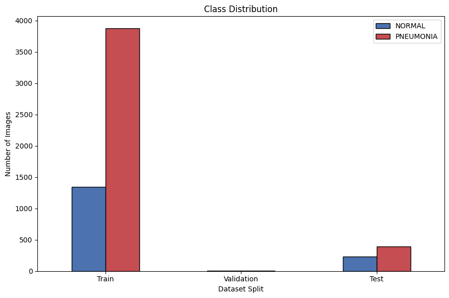
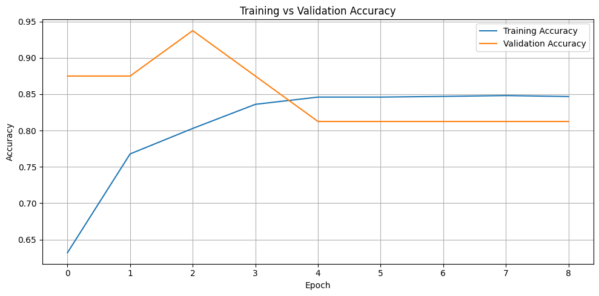
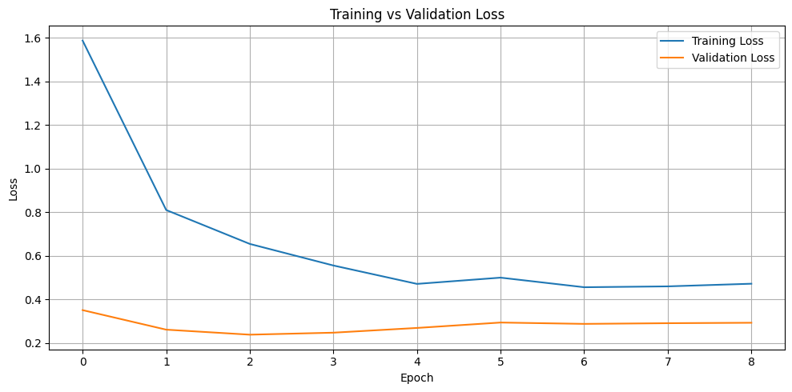
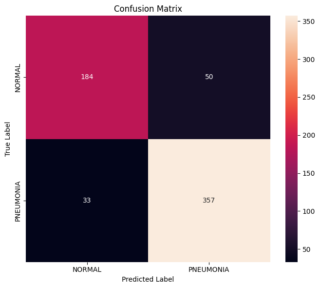
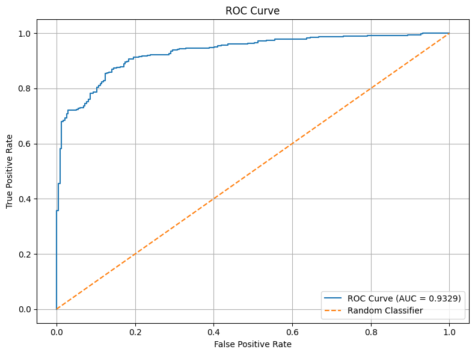

# Pneumonia Detection using CNN

## 1. Project Objective

The objective of this project is to develop a **Convolutional Neural Network (CNN) model** that classifies pediatric chest X-ray images into two categories:

- **NORMAL**
- **PNEUMONIA**

The images are divided into training, validation, and test sets. The model learns visual patterns from the training images and is evaluated on unseen test images.

---

## 2. Approach

The project follows an end-to-end deep learning workflow:

1. Load the chest X-ray dataset from Google Drive.
2. Inspect the dataset structure and class distribution.
3. Perform exploratory data analysis (EDA) using class counts and sample X-ray visualizations.
4. Resize and preprocess the images for CNN input.
5. Apply data augmentation to the training data.
6. Address class imbalance using balanced class weights.
7. Use **VGG16 pretrained on ImageNet** as the convolutional feature extractor.
8. Add a custom classification head for binary classification.
9. Train the model using training and validation data.
10. Use Early Stopping, learning-rate reduction, and Model Checkpointing to retain the best model.
11. Evaluate the best model on the independent test set.
12. Report Accuracy, Precision, Recall, F1 Score, and ROC-AUC, along with the confusion matrix and ROC curve.

---

## 3. Methodology

### 3.1 Dataset

The chest X-ray dataset is organized into:

```text
Archive/
├── train/
│   ├── NORMAL/
│   └── PNEUMONIA/
├── val/
│   ├── NORMAL/
│   └── PNEUMONIA/
└── test/
    ├── NORMAL/
    └── PNEUMONIA/
```

The class labels are:

```text
NORMAL    → 0
PNEUMONIA → 1
```

### 3.2 Exploratory Data Analysis

EDA is performed to understand the dataset before training. The notebook examines the distribution of NORMAL and PNEUMONIA images and displays sample X-ray images from the training set.

The class distribution is important because an imbalance between the two classes can influence model performance.

### 3.3 Image Preprocessing

The X-ray images are resized to the input dimensions required by the VGG16-based model. Training images are augmented to increase variation in the training data.

The training augmentation includes transformations such as:

- Rotation
- Width/height shifting
- Zoom
- Horizontal flipping

Validation and test images are evaluated without training augmentation.

### 3.4 Class Imbalance

Balanced class weights are calculated from the training labels using `compute_class_weight`. These weights are supplied during training so that the model does not simply favor the more frequent class.

### 3.5 CNN Architecture

The model uses **VGG16 with ImageNet pretrained weights** as the base network. The convolutional layers provide learned visual features, while a custom classification head performs the final binary classification.

The architecture is conceptually:

```text
Input X-ray
    ↓
VGG16 pretrained feature extractor
    ↓
Global Average Pooling
    ↓
Dropout
    ↓
Dense layer (128 neurons, ReLU)
    ↓
Dropout
    ↓
Dense layer (1 neuron, Sigmoid)
    ↓
NORMAL / PNEUMONIA
```

### 3.6 Training

The model is trained using the Adam optimizer and binary cross-entropy loss.

The training process uses:

- **Early Stopping** — stops training when validation performance stops improving and restores the best weights.
- **ReduceLROnPlateau** — lowers the learning rate when validation loss stops improving.
- **Model Checkpointing** — saves the best-performing model.

This helps reduce unnecessary training and retains the model with the best validation performance.

### 3.7 Model Evaluation

The saved best model is evaluated on the test set.

The following metrics are used:

- **Loss** — measures the model's prediction error.
- **Accuracy** — percentage of all correctly classified images.
- **Precision** — proportion of predicted PNEUMONIA cases that are actually PNEUMONIA.
- **Recall** — proportion of actual PNEUMONIA cases correctly identified.
- **F1 Score** — harmonic mean of precision and recall.
- **ROC-AUC** — measures the model's ability to distinguish between NORMAL and PNEUMONIA across different probability thresholds.

A confusion matrix is also used to inspect correct and incorrect predictions.

---

## 4. Results and Visualizations

The following figures are taken from the notebook and can be viewed directly in the repository.

### Class Distribution



### Training and Validation Accuracy



### Training and Validation Loss



### Confusion Matrix



### ROC Curve



---

## 5. Findings

The model's performance is assessed using multiple evaluation metrics rather than accuracy alone.

### Test Set Evaluation

| Metric | Result |
|---|---:|
| Loss | 0.2983 |
| Accuracy | 0.879808    (87.98%) |
| Precision | 0.886978    (88.70%) |
| Recall | 0.925641    (92.56%) |
| F1 Score | 0.905897    (90.59%) |
| ROC-AUC | 0.946154    (94.62%0 |

### Classification Report

The classification report provides class-wise performance using Precision, Recall, F1 Score, and Support.

```text
              precision    recall  f1-score   support

      NORMAL     0.8664    0.8034    0.8337       234
   PNEUMONIA     0.8870    0.9256    0.9059       390

    accuracy                         0.8798       624
   macro avg     0.8767    0.8645    0.8698       624
weighted avg     0.8792    0.8798    0.8788       624
```

The **confusion matrix** shows the number of NORMAL and PNEUMONIA images that were correctly and incorrectly classified. The **ROC curve and AUC** provide an additional view of the model's classification ability across different decision thresholds.

---

## 6. Limitations

- The model is trained and evaluated on the provided dataset and may not generalize perfectly to other hospitals, imaging devices, patient populations, or acquisition conditions.
- Model performance can be affected by class imbalance and variations in the X-ray images.
- A pretrained VGG16 model provides useful learned features, but further tuning or comparison with other architectures could potentially improve performance.
- The model is an academic project and should not be treated as a standalone clinical diagnostic system.

---

## 7. Conclusion

A VGG16-based CNN was developed to classify pediatric chest X-ray images as NORMAL or PNEUMONIA. The workflow included EDA, image preprocessing, data augmentation, class-weight handling, transfer learning, model training, and comprehensive evaluation.

Accuracy, Precision, Recall, F1 Score, ROC-AUC, the confusion matrix, and the ROC curve together provide a more complete assessment of the model than accuracy alone.

The final model results should be reported using the values generated by the final notebook run.

---

## 8. Project Structure

```text
Pneumonia Detection/
├── Pneumonia_Detection(2).ipynb
├── README.md
└── Pneumonia_Detection_Images/
    ├── class_distribution.png
    ├── accuracy.png
    ├── loss.png
    ├── confusion_matrix.png
    └── roc_curve.png
```

---

## 9. Tools and Technologies

- Python
- Google Colab
- TensorFlow / Keras
- VGG16
- NumPy
- Pandas
- Matplotlib
- Seaborn
- Scikit-learn
- PIL
