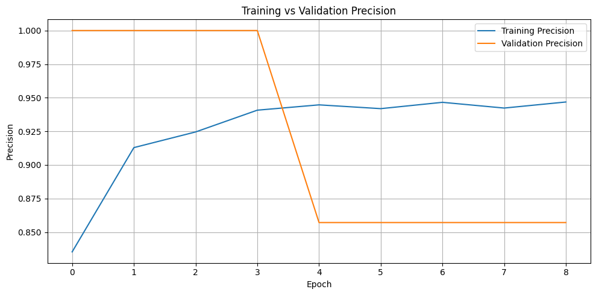
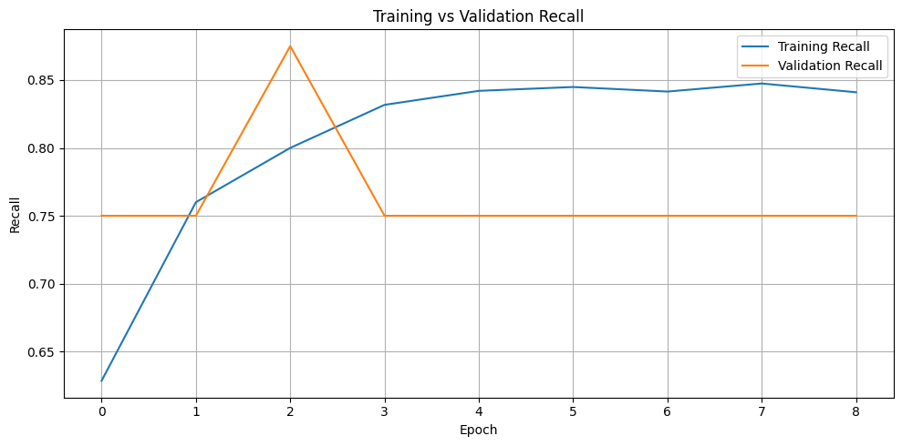

# Pneumonia Detection using CNN

## 1. Project Objective

The primary objective of this project is to develop and evaluate a deep learning-based image classification model capable of accurately distinguishing between **NORMAL** and **PNEUMONIA** cases from chest X-ray images. The project aims to build an end-to-end workflow involving exploratory data analysis, image preprocessing, data augmentation, model training, and performance evaluation using metrics such as accuracy, precision, recall, F1-score, ROC-AUC, sensitivity, and specificity. The ultimate goal is to assess the model’s ability to reliably identify pneumonia while minimizing incorrect classifications of normal X-rays.

---

## 2. Approach

The project follows an end-to-end supervised deep-learning workflow:

1. Load the chest X-ray dataset from Google Drive.
2. Inspect the dataset structure and class distribution.
3. Perform exploratory data analysis (EDA) using class counts and sample X-ray visualizations.
4. Resize and preprocess the images for CNN input.
5. Apply data augmentation to the training data.
6. Address class imbalance using balanced class weights.
7. Use VGG16 pretrained on ImageNet as the convolutional feature extractor.
8. Add a custom classification head for binary classification.
9. Train the model using training and validation data.
10. Use Early Stopping, learning-rate reduction, and Model Checkpointing to retain the best model.
11. Evaluate the best model on the independent test set.
12. Report Accuracy, Precision, Recall, F1 Score, Sensitivity, Specificity and ROC-AUC, along with the confusion matrix and ROC curve.

---

## 3. Methodology

### 3.1 Dataset

The dataset contains chest X-ray images organized into three main sets:

```text
Archive/
├── train/
│   ├── NORMAL/
│   └── PNEUMONIA/
├── val/
│   ├── NORMAL/
│   └── PNEUMONIA/
└── test/
    ├── NORMAL/
    └── PNEUMONIA/
```

The model performs binary classification:

```text
NORMAL    → Normal chest X-ray (0)
PNEUMONIA → Chest X-ray associated with pneumonia (1)
```

### 3.2 Exploratory Data Analysis

Exploratory Data Analysis was performed to understand the dataset before model training.

The analysis includes:

- Dataset structure inspection.
- Class distribution analysis NOEMAL and PNEUMONIA.
- Visualization of NORMAL and PNEUMONIA images.

The class distribution is important because an imbalance between classes can affect the model's learning and evaluation.

### 3.3 Image Preprocessing

The chest X-ray images are resized and preprocessed before being provided to the model.

Data augmentation is applied to the training images to introduce variation and help the model generalize better. 
The validation and test images are processed separately without training-time augmentation.

### 3.4 Class Imbalance

Balanced class weights are calculated from the training labels using `compute_class_weight`. These weights are supplied during training so that the model does not simply favor the more frequent class.

### 3.5 CNN Model

The model uses **VGG16 with ImageNet pretrained weights** as the base network. The convolutional layers provide learned visual features, while a custom classification head performs the final binary classification.

The overall workflow can be represented as:

```text
Input X-ray
    ↓
VGG16 pretrained feature extractor
    ↓
Global Average Pooling
    ↓
Dropout
    ↓
Dense layer (128 neurons, ReLU)
    ↓
Dropout
    ↓
Dense layer (1 neuron, Sigmoid)
    ↓
NORMAL / PNEUMONIA
```

### 3.6 Model Training

The model is trained using training data while its performance is monitored using validation data.
The model is trained using the Adam optimizer and binary cross-entropy loss.

The training process uses:

- **Early Stopping** — stops training when validation performance stops improving and restores the best weights.
- **ReduceLROnPlateau** — lowers the learning rate when validation loss stops improving.
- **Model Checkpointing** — saves the best-performing model.

This helps reduce unnecessary training and retains the model with the best validation performance.

The training process tracks:

- Training Accuracy
- Validation Accuracy
- Training Loss
- Validation Loss
- Training Precision
- Validation Precision
- Training Recall
- Validation Recall

The best-performing model is saved and later evaluated using the independent test dataset.

### 3.7 Model Evaluation

The final model is evaluated using several performance metrics:

- **Loss** — measures the prediction error.
- **Accuracy** — measures the proportion of correctly classified images.
- **Precision** — measures how many predicted PNEUMONIA cases are actually PNEUMONIA.
- **Recall** — measures how many actual PNEUMONIA cases are correctly identified.
- **F1 Score** — provides a balanced measure of Precision and Recall.
- **ROC-AUC** — measures the model's ability to distinguish between the two classes across different classification thresholds.
- **Sensitivity** — measures how effectively the model identifies actual PNEUMONIA cases.
- **Specificity** — measures how effectively the model identifies actual NORMAL cases.

A Classification Report, Confusion Matrix, and ROC Curve are also used for detailed evaluation.

---

## 4. Visualizations

### Class Distribution

The class distribution graph shows the number of NORMAL and PNEUMONIA images in the dataset. It helps identify whether there is any imbalance between the two classes before training the model.


### Training and Validation Accuracy

The training and validation accuracy graph shows how the model's classification accuracy changes across epochs. It helps compare the model's performance on the training data with its ability to generalize to unseen validation data.


### Training and Validation Loss

The training and validation loss graph shows how the model's prediction error changes during training. It helps identify whether the model is learning effectively and whether signs of overfitting or underfitting are present.


### Training and Validation Precision

The training and validation precision graph shows how accurately the model identifies PNEUMONIA cases among its positive predictions across different epochs. Comparing the training and validation curves helps evaluate how well precision generalizes beyond the training data.



### Training and Validation Recall

The training and validation recall graph shows how effectively the model identifies actual PNEUMONIA cases across different epochs. Comparing both curves helps evaluate whether the model maintains its ability to detect positive cases on the validation data.



### Confusion Matrix

The confusion matrix shows the number of NORMAL and PNEUMONIA images that were correctly and incorrectly classified.


### ROC Curve

The ROC curve and AUC provide an additional view of the model's classification ability across different decision thresholds.


---

## 5. Findings

The model's performance is assessed using multiple evaluation metrics rather than accuracy alone.

### Test Set Evaluation

The evaluation metrics summarize the model's overall performance using Accuracy, Precision, Recall, F1 Score, ROC-AUC, Sensitivity and Specificity.

| Metric | Result |
|---|---:|
| Loss | 0.2983 |
| Accuracy    | 0.866987 (86.70%) |
| Precision   | 0.877150 (87.71%) |
| Recall      | 0.915385 (91.54%) |
| F1 Score    | 0.895859 (89.59%) |
| ROC-AUC     | 0.932851 (93.29%) |
| Sensitivity | 0.915385 (91.54%) |
| Specificity | 0.786325 (78.63%) |


### Classification Report

The classification report summarizes the model's performance for both NORMAL and PNEUMONIA classes using Precision, Recall, F1 Score, and Support.

```text
              precision    recall  f1-score   support

      NORMAL     0.8479    0.7863    0.8160       234
   PNEUMONIA     0.8771    0.9154    0.8959       390

    accuracy                         0.8670       624
   macro avg     0.8625    0.8509    0.8559       624
weighted avg     0.8662    0.8670    0.8659       624
```

The results show that the model performs well on both classes. The higher Recall for the PNEUMONIA class indicates that the model successfully identifies a large proportion of the actual PNEUMONIA images.

---

## 6. Limitations

- The model is trained and evaluated on the provided dataset and may not generalize perfectly to images from different hospitals, devices, or patient populations.
- Model performance can be affected by class imbalance and variations in chest X-ray images.
- Performance may be influenced by class imbalance.
- A pretrained VGG16 model provides useful learned features, but further tuning or comparison with other architectures could potentially improve performance.
- The model is an academic project and should not be treated as a standalone clinical diagnostic system.

---

## 7. Possible Improvements

- **Fine-tuning VGG16:** Unfreeze additional layers of the pretrained VGG16 network and train them with a small learning rate to adapt the learned features more closely to chest X-ray images.
- **Hyperparameter tuning:** Experiment with different learning rates, batch sizes, dropout rates, and numbers of neurons in the dense layers.
- **Alternative CNN architectures:** Compare VGG16 with architectures such as ResNet, EfficientNet, or MobileNet to determine whether a different architecture provides better performance.
- **Improved data augmentation:** Experiment with additional medically appropriate image transformations to increase the diversity of the training data.
- **Cross-validation:** Use cross-validation to obtain a more robust estimate of model performance.
- **Larger and more diverse datasets:** Training on additional chest X-ray datasets from different sources could improve generalization.
- **Threshold optimization:** Instead of using only the default 0.5 classification threshold, investigate different thresholds to find a suitable balance between Precision and Recall.
- **Explainable AI:** Techniques such as Grad-CAM could be incorporated to visualize the regions of an X-ray that influence the model's prediction.
- **Specificity improvement: Focus on improving the model’s 78.63% specificity to better identify NORMAL cases while maintaining its high 91.54% sensitivity for detecting PNEUMONIA.**

---

## 8. Conclusion

This project developed a CNN-based model to classify chest X-ray images as NORMAL or PNEUMONIA. The workflow included EDA, image preprocessing, data augmentation, class-weight handling, transfer learning, model training, and comprehensive evaluation.

Accuracy, Precision, Recall, F1 Score, ROC-AUC, Sensitivity, Sepecificity together provide a more complete assessment of the model than accuracy alone.

The training and validation graphs, Classification Report, Confusion Matrix, and ROC Curve provide a comprehensive view of the model's performance.

---

## 9. How to Run

### 1. Open the Notebook

Open the **Pneumonia_Detection.ipynb** notebook using Google Colab.

### 2. Prepare the Dataset

Ensure that the chest X-ray dataset follows the required directory structure:

```text
Archive/
├── train/
│   ├── NORMAL/
│   └── PNEUMONIA/
├── val/
│   ├── NORMAL/
│   └── PNEUMONIA/
└── test/
    ├── NORMAL/
    └── PNEUMONIA/
```
### 3. Upload the project folder to your Google Drive and run the first cell.
Upload the dataset folder to google drive then, run the Google Drive mounting cell in the notebook and allow Colab to access the required files

### 4. Run the Notebook

Run the notebook cells in order from top to bottom.

The notebook will perform:

- Dataset loading
- Exploratory Data Analysis
- Image preprocessing
- Data augmentation
- Class-weight calculation
- Model construction
- Model training
- Training and validation visualizations
- Test-set evaluation
- Classification Report
- Confusion Matrix
- ROC Curve
- Final evaluation metrics

### 5. View the Results

After execution, the notebook will display all visualizations, evaluation metrics, the Classification Report, Confusion Matrix, and ROC Curve.

---

## 10. Tools and Technologies Used

- Python
- Google Colab
- TensorFlow / Keras
- VGG16
- NumPy
- Pandas
- Matplotlib
- Seaborn
- Scikit-learn
- PIL
